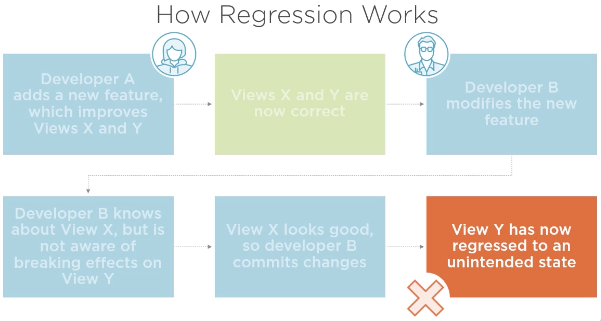
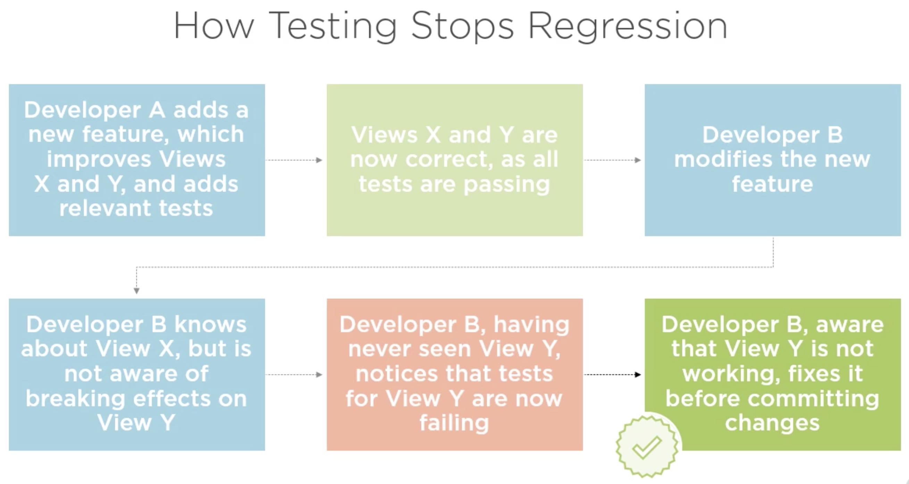
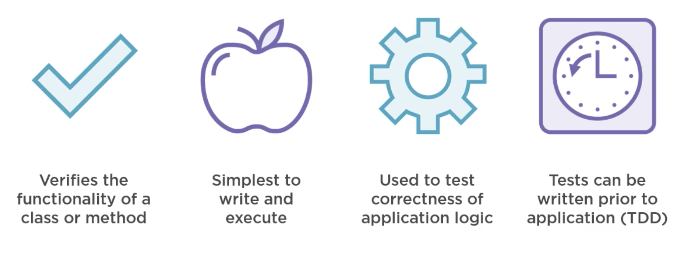
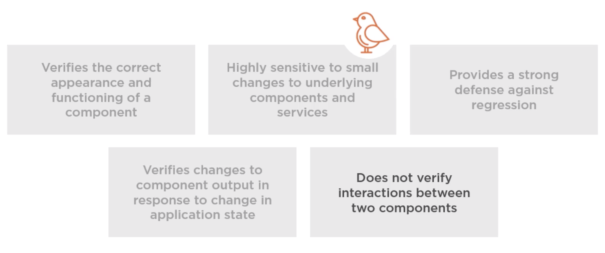
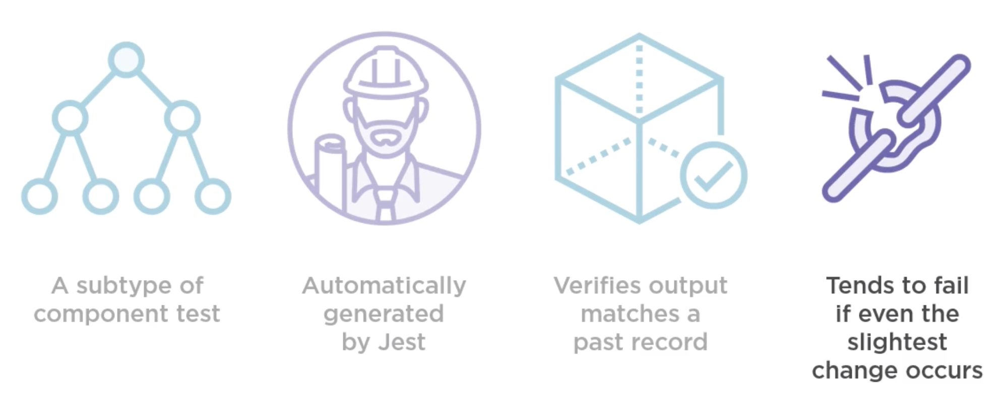
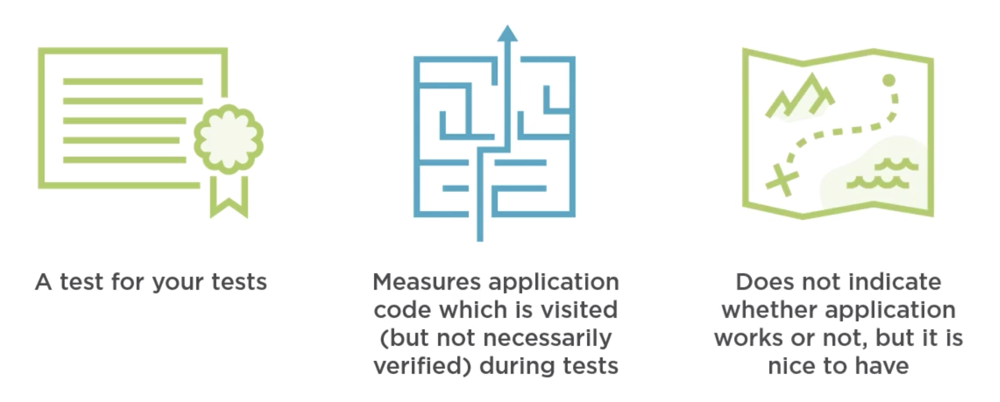
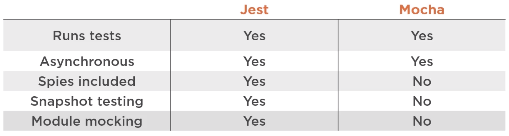
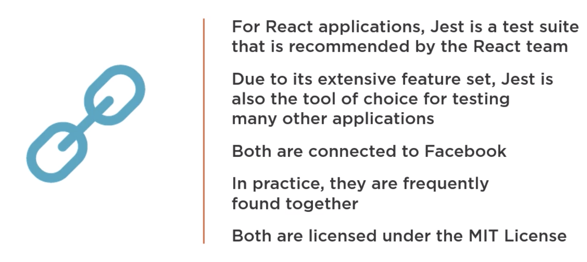
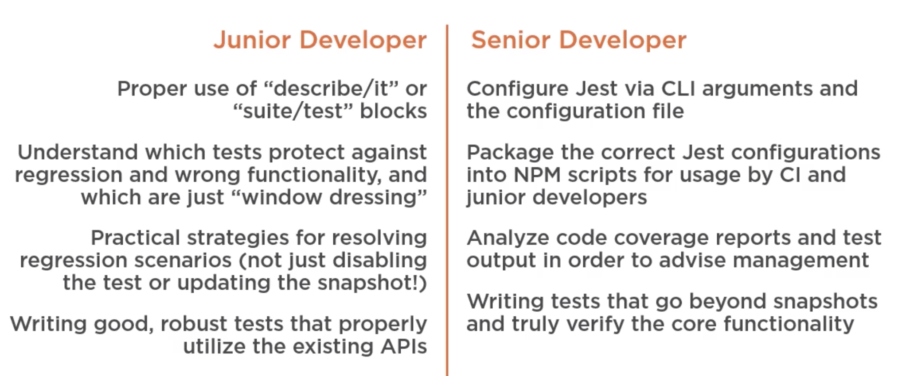
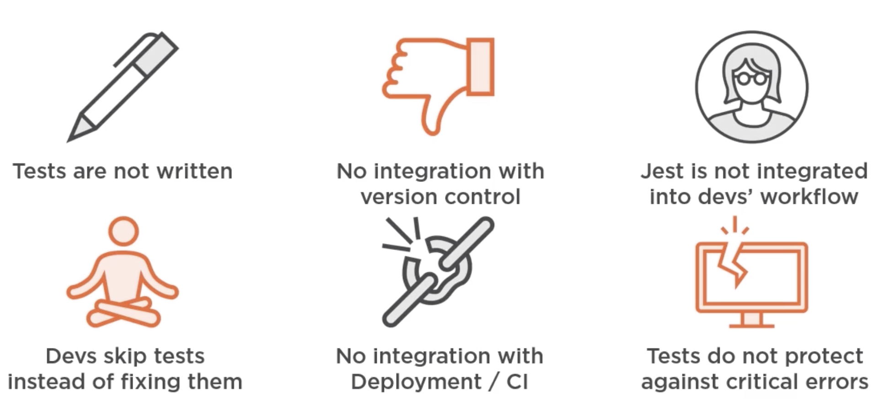

# Testing React applications with Jest

Curso da Pluralsight de como testar aplicações em React usando Jest

https://app.pluralsight.com/library/courses/testing-react-applications-jest/table-of-contents

## Why testing?

- Prevents regression
- Provides objective success criteria
- Facilitates complex modular applications

## What are Tests?

- A suite of tests is an application which checks your application
- Composed of assertions about how your code will execute
- Tests files are commited to the repo with application code
- Suite is run  quickly and routinely by CI tools

### Whats if Tests didn't exist?

- Someone would have manually check the whole application every change
- No easy way to know if your code has broken someone else's
- No way to mensure the "correctness" of the code
- As the application grow, the cost of manually checking for regression becomes burdensome
- Eventually, adding new features become too risky ans expensive, and the application can no longer grow

## Advantages and Disadvantages of testing

#### Advantages

- Prevents unexpected regression
- Reduces the need for manual verification
- Verify corner cases
- Allows developer to focus on current tasks (versus worrying about past ones)
- Allows for modular construction of applications that would otherwise be too complex

#### Disadvantages

- More code to write, debug and maintain
- More tools that developers need to be able to use
- Additional project dependency and cloud host compatibility concerns
- Tests must actually be used and respected to be of value
- Non-critical test failures may cause the app to be rejected on the CI level

## How regression works?



### How testing stops regression



## Different kinds of tests

> Type of test

```
1) Unit test
2) Component test
3) Snapshot test
4) End-to-end test
```

> What it tests

```
1) A single function or service
2) A single component (functionality)
3) A single component (regression)
4) Interaction between multiple components
```

> Required tool

```
1) Mocha / Jest
2) Jest / Enzyme
3) Jest
4) Protactor / Cypress
```

### Unit tests



### Component tests



### Snapshot tests



### Coverage tests



# Introduction to Jest

### What is Jest?

- A library installed via npm or yarn and run via the command line
- Similar to popular test-runners but with handy extra features
- A tool made by a team incluing members of the React team

### More about Jest

- Built on the top of Jasmine/Mocha (Jasmine and Mocha doesn't have mock and snapshot. Jest has.)
- Adds snapshot testing, mocking and many other useful features
- Includes superior assertion library, CLI
- Works with or without React

## Enzyme

- Not a test runner like Jest, but provides tools to test React app specifically
- Expresses component output as HTML (Like React test renderer)
- Potentially useful but not for every project

## Jest vs. Mocha



## Jest and Jest CLI

> **Jest**

The actual test-runner library which you use to execute your tests

> **Jest CLI**

A tool that you use from the command line to run and provide configuration options to Jest (the test runner)

## Jest and React | What's the connection?



## Different Jest Skillset



## Common Jest Pitfalls



# Fundamentals of Jest Testing

## Jest installation

- Installed via NPM like many other libraries
- Local installation should determine version, but in practice CLI may call local or global  installation
- CI installs Jest and CLI automatically, usually based on package.json

```bash
npm install -g jest-cli
```

```bash
npm install jest --save
```

## Running tests

- Tests are run by using the Jest CLI (typing "jest" followed by arguments in the command line)
- The correct configuration for various different test patterns are stored as NPM scripts
- In pratice, tests are "run" by CI software and "watched" by everything else

> package.json

```bash
"scripts": {
  "test": "jest"
}
```

```bash
npm run test
```

## Creating test files

### How are test files identified?

- Any files inside a folder named __tests__ are considered tests

```bash
__tests__/*js
```

- Any file with .spec or .test in their filename are considered tests

```bash
*.spec.js
*.test.js
```

## Jest Globals

> it (test)

Method which you pass a function to, that function is executed as block of tests by the test runner

> describe (suite)

An optional method for grouping any number of _it_ or _test_ statements

```bash
describe('Describes what we are testing', () => {
  it('The thing that we are specifically testing', () => {

  });
});
```

### Watching for changes

```bash
jest --watch
```

- In "watch mode" tests are run automatically as files changes
- Only tests pertaining to changed files are run
- Jest detects changes automatically
- Actively prevents regression

## beforeEach and beforeAll

- beforeEach runs a blockc of code before each test
- Useful for setting up databases, mock instances, etc
- beforeAll runs code just onde, before the first test

## afterEach and afterAll

- Inverse versions of beforeEach and beforeAll
- Runs a block of code after each test (or after the last test)
- Useful for closing open connections, terminating sub-process

## Skipping and Isolating Tests

- Skipping a test results in that test not being run
- Isolating a test result in only it (an any other isolated tests) running

```js
it.skip('', () => {});
```

```js
it.only('', () => {});
```

## Asynchronous Testing

### What are asynchronous tests?

- Contains assertions (like a regular test)
- Does not complete instantaneously
- Can take varying amounts of time, even an unknown amout of time
- Jest must be notified that test is complete

### Defining asynchronous tests

- Invoke the ```done()``` callback that is passed to the test
- Return a promise from a test
- Pass an async function to ```describe```

```js
it('async test 1', done => {
  setTimeout(done, 100);
});
```

```js
it('async test 2', () => {
  return new Promise(resolve => {
    setTimeout(resolve, 100)
  });
});
```

```js
it('async test 3', async () => {
  await delay(100);
});
```

> The ways of formatting an async test shown gere are roughly equivalent

> Delay is a method that returns a promise