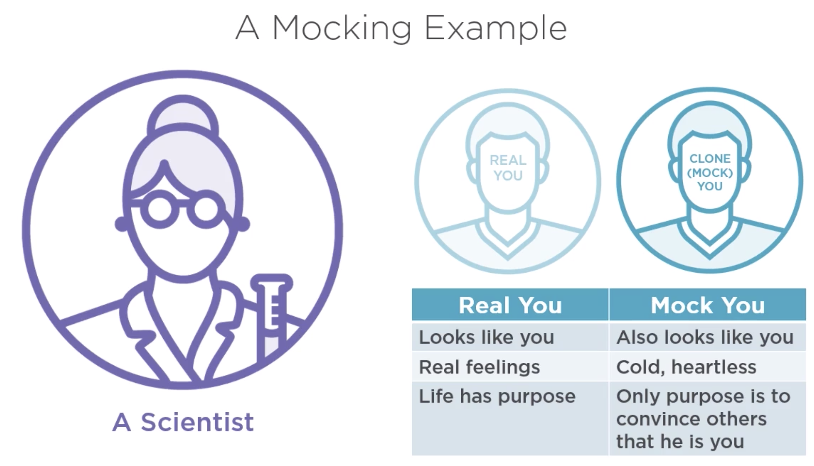
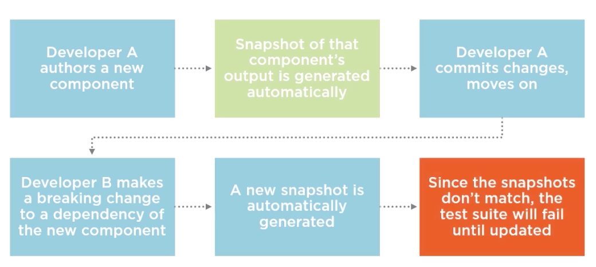

# Testing React applications with Jest

Curso da Pluralsight de como testar aplicações em React usando Jest

https://app.pluralsight.com/library/courses/testing-react-applications-jest/table-of-contents

## Why testing?

- Prevents regression
- Provides objective success criteria
- Facilitates complex modular applications

## What are Tests?

- A suite of tests is an application which checks your application
- Composed of assertions about how your code will execute
- Tests files are commited to the repo with application code
- Suite is run  quickly and routinely by CI tools

### Whats if Tests didn't exist?

- Someone would have manually check the whole application every change
- No easy way to know if your code has broken someone else's
- No way to mensure the "correctness" of the code
- As the application grow, the cost of manually checking for regression becomes burdensome
- Eventually, adding new features become too risky ans expensive, and the application can no longer grow

## Advantages and Disadvantages of testing

#### Advantages

- Prevents unexpected regression
- Reduces the need for manual verification
- Verify corner cases
- Allows developer to focus on current tasks (versus worrying about past ones)
- Allows for modular construction of applications that would otherwise be too complex

#### Disadvantages

- More code to write, debug and maintain
- More tools that developers need to be able to use
- Additional project dependency and cloud host compatibility concerns
- Tests must actually be used and respected to be of value
- Non-critical test failures may cause the app to be rejected on the CI level

## How regression works?


### How testing stops regression


## Different kinds of tests

> Type of test

```
1) Unit test
2) Component test
3) Snapshot test
4) End-to-end test
```

> What it tests

```
1) A single function or service
2) A single component (functionality)
3) A single component (regression)
4) Interaction between multiple components
```

> Required tool

```
1) Mocha / Jest
2) Jest / Enzyme
3) Jest
4) Protactor / Cypress
```

### Unit tests


### Component tests


### Snapshot tests


### Coverage tests


# Introduction to Jest

### What is Jest?

- A library installed via npm or yarn and run via the command line
- Similar to popular test-runners but with handy extra features
- A tool made by a team incluing members of the React team

### More about Jest

- Built on the top of Jasmine/Mocha (Jasmine and Mocha doesn't have mock and snapshot. Jest has.)
- Adds snapshot testing, mocking and many other useful features
- Includes superior assertion library, CLI
- Works with or without React

## Enzyme

- Not a test runner like Jest, but provides tools to test React app specifically
- Expresses component output as HTML (Like React test renderer)
- Potentially useful but not for every project

## Jest vs. Mocha


## Jest and Jest CLI

> **Jest**

The actual test-runner library which you use to execute your tests

> **Jest CLI**

A tool that you use from the command line to run and provide configuration options to Jest (the test runner)

## Jest and React | What's the connection?


## Different Jest Skillset


## Common Jest Pitfalls


# Fundamentals of Jest Testing

## Jest installation

- Installed via NPM like many other libraries
- Local installation should determine version, but in practice CLI may call local or global  installation
- CI installs Jest and CLI automatically, usually based on package.json

```bash
npm install -g jest-cli
```

```bash
npm install jest --save
```

## Running tests

- Tests are run by using the Jest CLI (typing "jest" followed by arguments in the command line)
- The correct configuration for various different test patterns are stored as NPM scripts
- In pratice, tests are "run" by CI software and "watched" by everything else

> package.json

```bash
"scripts": {
  "test": "jest"
}
```

```bash
npm run test
```

## Creating test files

### How are test files identified?

- Any files inside a folder named __tests__ are considered tests

```bash
__tests__/*js
```

- Any file with .spec or .test in their filename are considered tests

```bash
*.spec.js
*.test.js
```

## Jest Globals

> it (test)

Method which you pass a function to, that function is executed as block of tests by the test runner

> describe (suite)

An optional method for grouping any number of _it_ or _test_ statements

```bash
describe('Describes what we are testing', () => {
  it('The thing that we are specifically testing', () => {

  });
});
```

### Watching for changes

```bash
jest --watch
```

- In "watch mode" tests are run automatically as files changes
- Only tests pertaining to changed files are run
- Jest detects changes automatically
- Actively prevents regression

## beforeEach and beforeAll

- beforeEach runs a blockc of code before each test
- Useful for setting up databases, mock instances, etc
- beforeAll runs code just onde, before the first test

## afterEach and afterAll

- Inverse versions of beforeEach and beforeAll
- Runs a block of code after each test (or after the last test)
- Useful for closing open connections, terminating sub-process

## Skipping and Isolating Tests

- Skipping a test results in that test not being run
- Isolating a test result in only it (an any other isolated tests) running

```js
it.skip('', () => {});
```

```js
it.only('', () => {});
```

## Asynchronous Testing

### What are asynchronous tests?

- Contains assertions (like a regular test)
- Does not complete instantaneously
- Can take varying amounts of time, even an unknown amout of time
- Jest must be notified that test is complete

### Defining asynchronous tests

- Invoke the ```done()``` callback that is passed to the test
- Return a promise from a test
- Pass an async function to ```describe```

```js
it('async test 1', done => {
  setTimeout(done, 100);
});
```

```js
it('async test 2', () => {
  return new Promise(resolve => {
    setTimeout(resolve, 100)
  });
});
```

```js
it('async test 3', async () => {
  await delay(100);
});
```

> The ways of formatting an async test shown gere are roughly equivalent

> Delay is a method that returns a promise

# Understanding Jest mocks

## Why mocking?

- Reduce dependencies required by tests (faster execution)
- Prevent side-effects during testing
-Build custom mocks to facilitate desired testing procedures

## What is a mock?



- A convincing duplicate of an object with no internal workings
- Can be automatically or manually created
- Has same API as original, but no side-effetcs
- Spies and other mock features simplify testing

## The mocking process

- Scan the original object for methods, give the new object spy methods with the same names
- Ensure that any methods which returned a promise still return a promise in the mock
- Create mock for any complex values that are returned from methods which are required for tests

## Mock functions

- Also known as "spies"
- No side-effects
- Counts functions calls
- Records arguments passed when called
- Can be "loaded" with return values
- Return value must approximate original

## Creating mock files

- Appropriately named NPM mocks are loaded automatically
- Mocks must reside in a ```__mocks__``` folder next to mocked module
- NPM modules and local modules can both be mocked

## Mocking - Demo

> fetch-question-saga.spec.js

```js
import { handleFetchQuestion } from './fetch-question-saga';
import fetch from 'isomorphic-fetch';

describe('Fetch question saga', () => {
  beforeAll(() => {
    fetch.__setValue([{ question_id: 42 }]);
  });

  it('should fetch the question', async () => {
    const gen = handleFetchQuestion({ question_id: 42 });
    const { value } = await gen.next(); 
    expect(value).toEqual([{ question_id: 42 }]);
    expect(fetch).toHaveBeenCalledWith(`/api/questions/42`);
  });
});
```

> __mocks __/isomorphic-fetch.js

```js
let __value = 42;
const isomorphicFetch = jest.fn(() => __value);
isomorphicFetch.__setValue = v => __value = v;

export default isomorphicFetch;
```

## Automatic / Manual Mocking

- In some setups, any require statements will have mocks generated automatically
- If a manual mock file exists, it will be used as the mock instead of the automatic version
- Most apps require some combination of manual and automatic mocking

### Manual Mocks

- Exists as a separate file alongside the file being mocked
- Manual mocks will be used automatically for NPM modules
- Manual mocks are more work than automatic mocks
- Needs to be updated when mocked file changes

### Automatic Mocking

- Most modules can be automatically replaced with mocks
- Mocks are usually generated correctly, but sometimes not
- Greatly reduced likelihood of side-effects during tests
- Developer must use discretion

### Automatic Mocking Challenges

- Methods returning a specific and complex value often can't be mocked automatically
- Methods that are not part of your module at compile-time won't be mocked
- Modules that you did not expect to be mocked may be mocked

# Snapshot Testing

 ## What is a Snapshot?

 - JSON-based record of a component's output
 - Compared to component's actual output during testing process
 - Committed along with other modules and tests to the application repo

 ## How Snapshots testing works

```js
import renderer from 'react-test-renderer';
import { MyComponent } from './MyComponent';

const tree = renderer.create(<MyComponent title='The meaning of life' />);

expect(tree.toJSON()).toMatchSnapshot();
```

First, HTML output is generated with React.
> Note: ```react-test-renderer``` is used instead of ```react-dom```, ```enzyme``` is not used

The first time ```toMatchSnapshot()``` is called, a snapshot is created.
Each subsequent time, the new snapshot is compared with the old one.

## The Snapshot testing process



## Snapshot - Demo

> TagsList.spec.js

```js
import React from 'react';
import TagsList from './TagsList'; 
import renderer from 'react-test-renderer';

describe('The Tags List', () => {
  it('should render a snapshot', () => {
    const tree = renderer.create(<TagsList tags={['css', 'html', 'js']} />);

    expect(tree.toJSON()).toMatchSnapshot();
  });
});
```

## Advantages and Disadvantagens

### Advantages

- Fast and automatic
- Catches regressions humans may miss
- Works nicely with libraries that take in state and output HTML components (React, Angular, Vue)
- Adds some protection against regression when no time is available for manually writing tests
- Requires little training or knowledge of testing to use

### Advantages

- Easy to ignore and suppress
- Protects only against regression
- If a component is working incorrectly and then is fixed, a snapshot test will say it is now broken
- Add extra files to an already crowded repo
- Sensitive to incidental changes
- A waste of resources, if a component is certain to be modified in near future

## Updating Snapshots

- Tests must be run with ```--update```flag
- Old snapshots will be replaced with image of current output
- Using ```--update``` without careful consideration diminishes the value of snapshots

## Update Snapshots - Demo

```bash
jest --update or jest -u
```

# Testing React Components
 
 ## What does testing React Components mean?

 - Verify output has not regressed
 - Ensure that rarely occuring corner cases produce the correct output
 - If component generates side effects, verify they occur but do not execute them
 - Verify user interactions are handled as expected

 ## Constructuring testable React Components

 ### A spectrum of React Components

 - Components may or may not have lifecycle handlers
 - Components may or may not have internal state
 - Components may or may not generate side effects
 - Components may get state from arguments, or from external dependencies

### Building testable React Components

- No internal state - output is an idempotent product of the props that are provided
- No side-effects - any AJAX calls, UI changes or other side effects are handled by sagas, thunks, etc., but not by components
- No lifecycle hooks - fetching data is handled on the application leve, not the component level

## React Redux and Jest: a fine pair

- Components don't generate side effects
- Component consists of logical display and container components
- Components do not have internal state

### Testing React Redux Components

- Test Container and Display elements separately
- Use unit tests to verify methods and properties passed by container are accurate
- Use snapshots tests to verify the output of the display component, passing props in directly

## React Redux Container Testing - Demo

> src/__ tests __/QuestionDetail.js
> src/components/QuestionDetail.jsx

```js
import { mapStateToProps } from '../QuestionDetail';

describe('The Question Detail Component', () => {
  describe('The Container Element', () => {
    describe('mapStateToProps', () => {
      it('should map the state to props correctly', () => {
        const sampleQuestion = {
          question_id: 42,
          body: 'Space is big'
        };
        const appState = {
          questions: [sampleQuestion]
        };
        const ownProps = {
          question_id: 42
        };
        const componentState = mapStateToProps(appState, ownProps);
        console.log(componentState);
        expect(componentState).toEqual(sampleQuestion);
      });
    });
  });
});
```

## React Redux Display Testing - Demo

> src/__ tests __/QuestionDetail.js

Will generate a snapshot!!

```js
import { mapStateToProps, QuestionDetailDisplay } from '../QuestionDetail';
import renderer from 'react-test-renderer';
import React from 'react';

describe('The Display element', () => {
  it('should not regress', () => {
      const tree = renderer.create(<QuestionDetailDisplay title='The meaning of life' body='42' answer_count={3} tags={['css', 'html', 'js']} />);

      expect(tree.toJSON()).toMatchSnapshot();
  });
});
```

## Enzyme vs. React Test Renderer

### React test renderer

- Takes a React component and outputs the resulting HTML without a DOM
- From the React team
- Useful for getting the output HTML of a component for snapshot testing
- Recommended by the Jest Team

### Enzyme

- Takes a React component and outputs the resulting HTML without a DOM
- From an unrelated, but respected team (AirBnB)
- Useful for testing a variety of interactions including click , keyboard input, and more
- Has a variety of open bugs which make using it a challenge

## Testing Stateful React Components

- Mock dependencies, then test them 
- Use spies to verify side-effects
- Move logic from lifecycle to services
- Prevent regression with snapshots
- Inject values by writing mocks for services
- Make stateless components, where possible

## Building a Stateful React Component - Demo

> src/components/NotificationsViewer.jsx
> src/App.jsx

```js
import React from 'react';
import NotificationsService from '../services/NotificationsService';

export default class extends React.Component {
  constructor(...args) {
    super(...args);
    this.state = {
      count: -1
    }
  }

  async componentDidMount() {
    let { count } = await NotificationsService.GetNotifications();
    this.setState({
      count
    });

    console.log(count);
    
  }

  render() {
    return (
      <section className='mt-3 mb-2'>
        <div className='notifications'>
          {this.state.count !== -1 ? `${this.state.count} Notifications Awaiting!` : 'Loading...' }
        </div>
      </section>
    )
  }
}
```

> src/services/NotificationsService.js

```js
import { delay } from "redux-saga";

export default {
  async GetNotifications() {
    console.warn('REAL NOTIFICATION SERVICE! REALLY CONTACTING API!');
    await delay(1000);
    return { count: 42 };
  }
}
```

## Testing a Stateful React Component - Demo

## Advanced Jest Matchers

### What is a Matcher?

- Also knows as an assertion or expectation
- Represents a claim that avalue be equal (or not) to something
- Throws an error (test fails) if matcher's claim is not validated

### Exploring Matchers

> Not

- Reverses an assertion
- If assertion without not would pass, assertion with not will fail

> To Be and To Equal

- Verify that two values are equivalent
- Two arrays with matching elements are equal, but not identical
- Very general - use more specific matcher when possible

> To Be Close To

- Like toEqual for numbers, but assertion still passes if numbers are close but not equal
- For assertions involving floating point numbers

> To Contain & To Have Length

- Array matchers which verify the contents and size of a collection
- More succinct than combining ```toEqual``` with array operators ```includes```, ```length```, etc.

### Jest Matchers - Demo

> src/reducers/questions.spec.js

```js
import { questions } from './questions';

describe('The questions reducer', () => {
  it('should work', () => {
    const state = ['foo', 'bar'];
    const stateClone = ['foo', 'bar'];
    const newState = questions(state, { type: 'UNRECOGNIZED_ACTION' })
    
    expect(newState).toEqual(stateClone);
    expect(newState).toBe(state);
  });

  it('should add new questions', () => {
    const state = [{question_id: 'foo'}, {question_id: 'bar'}];
    const newQuestion = {question_id: 'baz'};
    const newState = questions(state, {type: 'FETCHED_QUESTION', question: newQuestion});

    expect(newState).toContain(newQuestion);
    expect(state).not.toContain(newQuestion);
    expect(newState).toHaveLength(3);
  });
});
```
